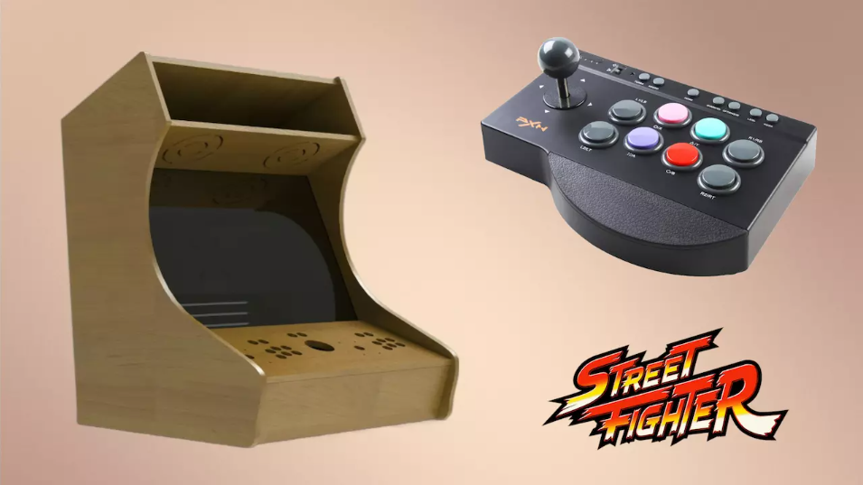

# Markdown6.6
# Proyecto de Digitalización

## Creación de una Máquina Recreativa con un Ordenador Antiguo

**Autor:** Daniel Sáez Sáez  
**Curso:** 1º DAM - C.D.P. San Ignacio

---

## Índice

1. [Introducción](#1-introducción)
2. [Hardware](#2-hardware)
   - [Especificaciones del PC](#21-especificaciones-del-pc)
   - [Imagen y sonido](#22-imagen-y-sonido)
   - [Mandos, teclado y ratón](#23-mandos-teclado-y-ratón)
   - [Montaje](#24-montaje)
3. [Software](#3-software)
   - [Partición de Disco](#31-partición-de-disco)
   - [Configuración de PCSX2](#32-configuración-de-pcsx2)
   - [Configuración de Batocera](#33-configuración-de-batocera)
   - [Instalación y configuración de BIOS](#34-instalación-y-configuración-de-bios)
   - [Instalación y configuración de las ISO](#35-instalación-y-configuración-de-las-iso)
4. [Bibliografía](#4-bibliografía)

---

## 1) Introducción

El trabajo consiste en la creación de una máquina recreativa utilizando únicamente componentes reciclados o antiguos. El objetivo principal es hacer que el proyecto sea fácil e intuitivo de usar para todos sus usuarios. Por esto, se ha tomado la decisión de implementar un sistema operativo que se pueda controlar con el mismo mando con el que se va a jugar, sin necesidad de conocimientos de informática.

---

## 2) Hardware

### 2.1) Especificaciones del PC

El ordenador cuenta con:
- **Procesador:** AMD FX-8350 Eight-Core 4000MHz
- **Disipación:** Kit de disipación que permite alcanzar altas temperaturas (60ºC en funcionamiento normal)
- **Disco duro:** HDD Seagate Barracuda de 1000GB
- **Memoria RAM:** 8GB (2x4GB), con una memoria física disponible de 6.1GB
- **Tarjeta gráfica:** NVIDIA GeForce GTX 660
- **Placa base:** ASRock 970 Extreme4

### 2.2) Imagen y sonido

- **Audio:** Se han utilizado los componentes internos de unos altavoces Logitech Z130, funcionando sin configuración adicional.
- **Vídeo:** Se requiere un adaptador VGA a HDMI, ya que la placa y la tarjeta gráfica no cuentan con salida VGA.
- **Monitor:** AOC, con un tiempo de respuesta de 5ms, resolución 1920x1080 píxeles a 60Hz (Full HD).

### 2.3) Mandos, teclado y ratón

- Se usó un teclado y ratón antiguos para la configuración inicial.
- Para jugar, se empleó un adaptador de mandos de PSX y PS2 a USB.
- Se utilizó el programa **Xpadder** para mapear teclas del teclado a los mandos.

### 2.4) Montaje

Se utilizaron materiales reciclados:
- Madera conglomerada
- Tornillos, tacos y pegamento específico para madera

Se realizó un plano previo en papel para marcar los cortes y ensamblaje de las piezas.

---

## 3) Software

### 3.1) Partición de Disco

- Se realizó una partición del disco para instalar dos sistemas operativos:
  - **Ubuntu** (para Batocera)
  - **Windows 10 Home 64 bits**
- Se utilizó **YUMI** para crear un USB multiboot con ambas imágenes de instalación.

### 3.2) Configuración de PCSX2

- Descargar y descomprimir el emulador.
- Introducir la BIOS de la PS2 (versión española en este caso).
- Configurar los mandos en el menú del emulador.
- Cargar la imagen ISO de los juegos deseados.

### 3.3) Configuración de Batocera

- Descargar la imagen de Batocera.
- Utilizar **Balena Etcher** para preparar un USB con Batocera.
- Instalarlo en el disco duro para que inicie automáticamente desde la partición correcta.

### 3.4) Instalación y configuración de BIOS y ISO

- Las BIOS e ISOs de los juegos se descargan de distintas fuentes.
- Se deben colocar en los directorios correspondientes de cada emulador.

---

## 4) Bibliografía

- [TutosPC - Instalación de PCSX2](https://www.youtube.com/watch?v=gPmxbuFy20A&ab_channel=TutosPC)
- [MandiGames - Configuración de Batocera](https://www.youtube.com/watch?v=VEquuvELZp8&ab_channel=MandiGames)