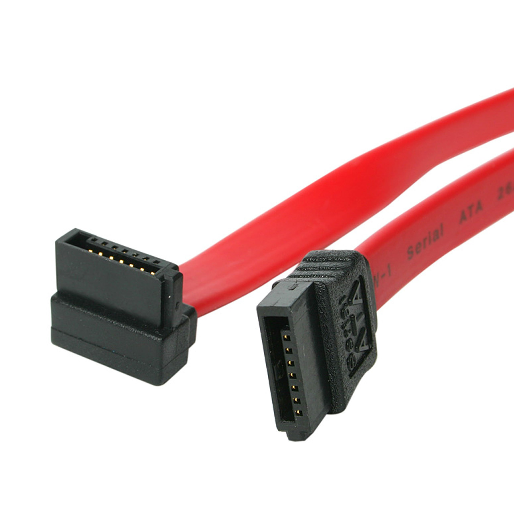
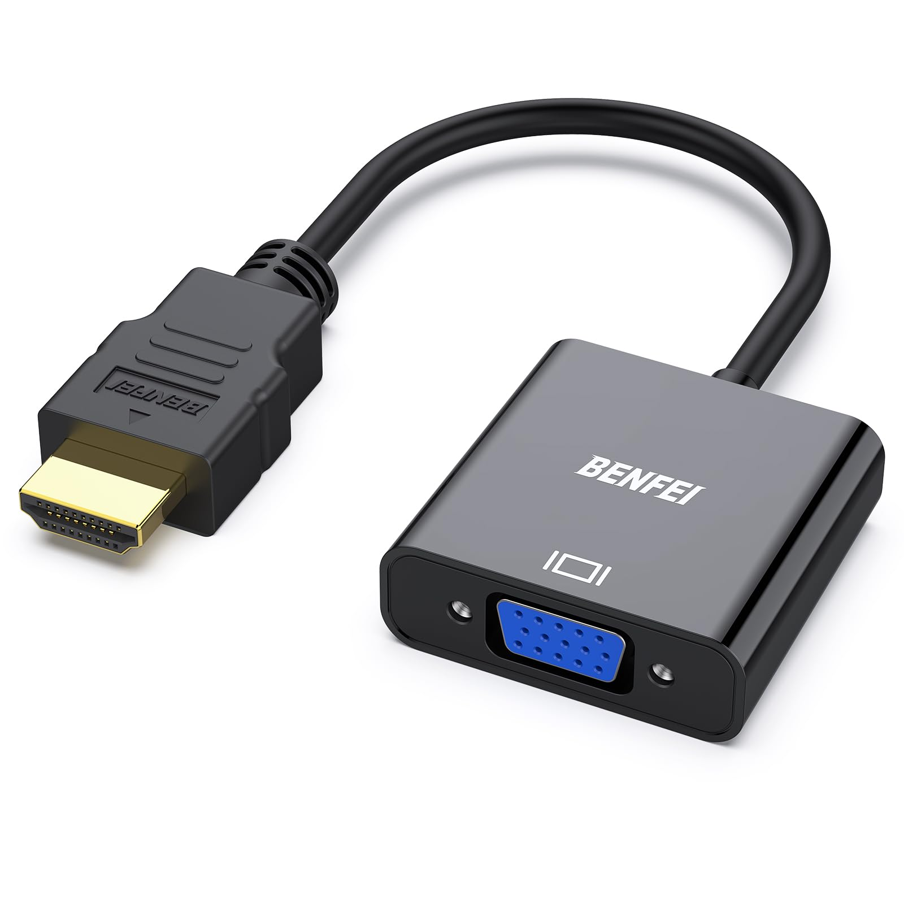

# Markdown6.6
# Proyecto de Digitalización

## Creación de una Máquina Recreativa con un Ordenador Antiguo

**Autor:** Daniel Sáez Sáez  
**Curso:** 1º DAM - C.D.P. San Ignacio

---

## Índice

1. [Introducción](#1-introducción)
2. [Hardware](#2-hardware)
   - [2.1)Especificaciones del PC](#21-especificaciones-del-pc)
   - [2.2)Imagen y sonido](#22-imagen-y-sonido)
   - [2.3)Mandos, teclado y ratón](#23-mandos-teclado-y-ratón)
   - [2.4)Montaje](#24-montaje)
3. [Software](#3-software)
   - [3.1)Partición de Disco](#31-partición-de-disco)
   - [3.2)Configuración de PCSX2](#32-configuración-de-pcsx2)
   - [3.3)Configuración de Batocera](#33-configuración-de-batocera)
   - [3.4)Instalación y configuración de BIOS](#34-instalación-y-configuración-de-bios)
   - [3.5)Instalación y configuración de las ISO](#35-instalación-y-configuración-de-las-iso)
4. [Bibliografía](#4-bibliografía)

---

## 1) Introducción

El trabajo consiste en la creación de una máquina recreativa, 
utilizando únicamente componentes reciclados o antiguos. El 
objetivo principal es hacer que el proyecto sea fácil e intuitivo de 
usar para todos sus usuarios. Por esto se ha tomado la decisión de 
implementar un sistema operativo que se pueda controlar con el 
mismo mando con el que se va a jugar y no haga falta ningún 
conocimiento de informática para usarlo. 

---

## 2) Hardware

Originalmente tenía pensado utilizar una raspberry pi, en concreto 
el modelo 5 ya que este cuenta con acceso a internet, es ligero, 
compacto, no se calienta mucho si se utiliza con un kit de 
refrigeración, etc. Sin embargo, los elevados precios me llevaron a 
reconsiderar realizar la totalidad del proyecto utilizando únicamente 
materiales reciclados. Escogí un ordenador en desuso, al igual que todos 
sus periféricos, para conseguir darle una segunda vida.  

### 2.1) Especificaciones del PC

El ordenador cuenta con un procesador AMD FX(tm)-8350 Eight-Core 4000MHz,
y con un kit de disipación que permite que el procesador alcance grandes temperaturas. 

Su temperatura normal de funcionamiento son 60ºC. He de mencionar que para realizar este proyecto no es necesario este tipo de procesadores o tarjetas gráficas dedicadas o de memoria RAM. Estos emuladores 
funcionan perfectamente en dispositivos mucho menos avanzados, 
ya que están muy bien optimizados. 
El disco duro que he utilizado es un HDD de estado sólido Seagate, Barracuda de 1000GB. Este contiene toda la información y los programas para que funcione el proyecto. La placa cuenta con dos tarjetas de expansión de memoria ram de 4 GB cada una. 

En total la placa cuenta con 8 GB de ram, aunque la memoria física disponible es de 6,1 GB. 

También cuenta con una tarjeta gráfica, en concreto una NVIDIA GeForce GTX 660. 

Y por último la placa base es una ASRock 970 Extreme4. 

Resumen
- **Procesador:** AMD FX-8350 Eight-Core 4000MHz
- **Disipación:** Kit de disipación que permite alcanzar altas temperaturas (60ºC en funcionamiento normal)
- **Disco duro:** HDD Seagate Barracuda de 1000GB
- **Memoria RAM:** 8GB (2x4GB), con una memoria física disponible de 6.1GB
- **Tarjeta gráfica:** NVIDIA GeForce GTX 660
- **Placa base:** ASRock 970 Extreme4

### 2.2) Imagen y sonido

Para la salida de audio de la placa se han utilizado los componentes internos de unos altavoces logitech Z130. Éstos funcionan directamente sin ningún tipo de configuración previa. 

Para la imagen es necesario un adaptador de VGA a HDMI, ya que la placa ni la tarjeta gráfica cuentan con una salida de VGA. El monitor solo cuenta con una salida de video de VGA. He utilizado un monitor AOC, con un tiempo de respuesta de 5  ms, resolución 1920x1080 píxeles a  60Hz (Full HD). 

### 2.3) Mandos, teclado y ratón

Para el manejo de la interfaz y la configuración de la placa es 
necesario el uso de un teclado y un ratón, en mi caso utilicé unos 
viejos que estaban por mi garaje.

Para poder jugar de una manera más fácil, y para poder controlar el 
emulador de Batocera he utilizado un adaptador de conectores de 
mandos de PSX y PS2 a usb para reutilizar mandos antiguos. 

Para poder configurarlos sin problema y guardar distintos inputs, he 
utilizado el programa xpandder, he incluso te permite vincular teclas 
del teclado.

### 2.4) Montaje

Se han utilizado distintos retales de madera reciclada 
(conglomerada), tornillos, tacos y pegamento específico para 
madera. Previamente se ha realizado un plano a papel, es decir se 
han dibujado las siluetas a cortar a papel para tener una plantilla.

---

## 3) Software

Se ha realizado una partición del disco, permitiendo tener en una 
parte la última versión estable de Ubuntu (para la instalación de 
Batocera), y en la otra parte tener Windows home 10 para 64 bits. 

### 3.1) Partición de Disco

Para poder hacer la partición del disco lo tuve que formatear, para 
ello necesité una memoria USB que utilicé como método de 
instalación. El programa YUMI me permite que el mismo disco 
extraíble USB sea multiboot, es decir, me permite tener la imagen 
tanto de windows 10 como de Ubuntu. 

### 3.2) Configuración de PCSX2

La configuración de este emulador es sencilla, ya que lo único que 
hace falta es descargar el emulador en cuestión, descomprimir el 
archivo .zip, introducir la BIOS de la consola PS2, en mi caso la 
española. Introducir cómo se quiere utilizar los mandos o cuáles de 
ellos usar, mediante el menú del propio emulador. Y finalmente 
introducir la imagen ISO de los juegos deseados.

### 3.3) Configuración de Batocera

Para configurar Batocea es un poco más complicado ya que, a 
parte de descargar la imagen de Batocera, hay que utilizar un USB 
con el programa balena etcher. Este nos permite preparar la 
memoria extraíble para que se pueda utilizar como recreativa 
portátil, aunque luego se instale en el mismo disco duro. Esto nos 
permite que al momento de iniciar el ordenador, dependiendo de la 
partición que estemos utilizando no haya que tocar nada para que 
se inicie. 

### 3.4) Instalación y configuración de BIOS y ISO

Tanto las BIOS y las imágenes ISO se pueden descargar en 
numerosas páginas que las proporcionan. Y para su configuración 
lo único que hay que hacer es colocarlas dentro de cada emulador, 
en sus repositorios correspondientes. 

---

## 4) Bibliografía

- [TutosPC - Instalación de PCSX2](https://www.youtube.com/watch?v=gPmxbuFy20A&ab_channel=TutosPC)
- [MandiGames - Configuración de Batocera](https://www.youtube.com/watch?v=VEquuvELZp8&ab_channel=MandiGames)